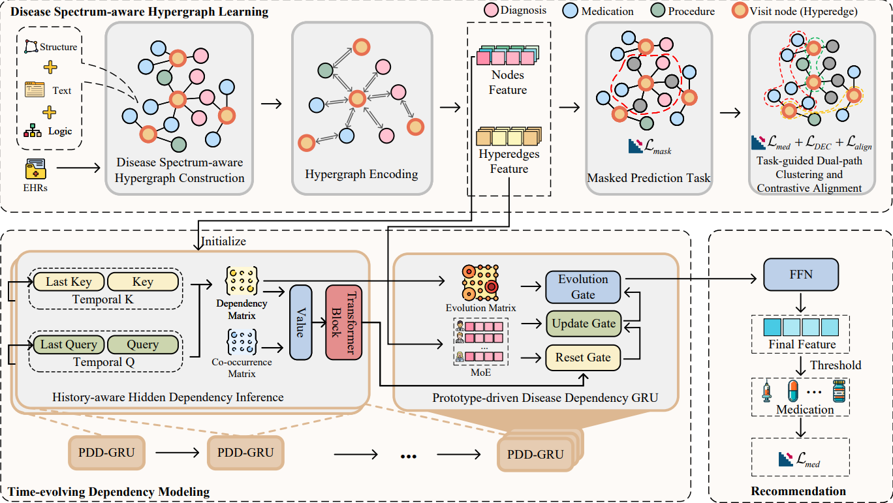

# SpecTD-MR
Disease Spectrum-aware and Time-evolving Dependency Learning for Medication Recommendation

## 📝 Overview

This repository contains the official PyTorch implementation of the paper: Disease Spectrum-aware and Time-evolving Dependency Learning for Medication Recommendation.

In this work, we propose SpecTD-MR, a novel framework designed to address the limitations of disease spectrum fragmentation and implicit dependency modeling in medication recommendation systems. By synergizing a Disease Spectrum-aware Hypergraph Learning module with a Time-evolving Dependency Modeling module, our approach unifies pathologically related diagnoses into cohesive representations and explicitly quantifies the fine-grained, causal evolution of patient health states.

## 🚀 Quick Start

1. Prepare the environment and preprocess both MIMIC datasets (see ⚙️ Setup).
2. Run Stage-I pretraining to learn spectrum-aware concept representations (Stage-I Pretraining).
3. Launch Stage-II medication recommendation to fine-tune SpecTD-MR with downstream supervision (Stage-II Recommendation).
4. Inspect logs under `pretrain_logs/` and `downstream_logs/`, then evaluate the generated medication predictions.

## 🌟 Key Contributions

- We propose SpecTD-MR, a unified framework that synergistically addresses the limitations of fragmented disease spectra and coarse-grained implicit disease evolution. By rethinking diagnosis codes as interconnected components of latent disease spectra and shifting from holistic hidden states to explicit dependency inference, SpecTD-MR offers a more clinically grounded approach to EHR modeling.

- We develop a Disease Spectrum-aware Hypergraph Learning module to overcome the fragmentation of disease spectra. Unlike existing methods that isolate clinically related diagnoses, we employ task-guided dual-path clustering with contrastive alignment. This novel approach unifies disparate but pathologically similar concepts into cohesive representations, effectively bridging the semantic gap in sparse clinical data. 

- We introduce a Time-evolving Dependency Modeling module that explicitly quantifies fine-grained dependency strengths and models the process of disease evolution. This module enables adaptive, pathology-driven state transitions based on disease evolution intensity rather than generic temporal updates.

- Extensive experiments on MIMIC-III and MIMIC-IV demonstrate that SpecTD-MR clearly outperforms state-of-the-art baselines. Beyond accuracy, our framework provides transparent and interpretable reasoning for its recommendations by visualizing dynamic disease dependencies and spectrum structures, which is crucial for trusted clinical decision support.

## 🏗️ Model Architecture


## ⚙️ Setup
### Environment

```shell
python==3.9.18
torch==2.1.0
tqdm==4.67.1
dgl==1.1.2.cu118
scikit-learn==1.6.1
```

You can build the conda environment for our experiment using the following command:

```shell
conda env create -f environment.yml
```

### 📊 Datasets
We used two datasets, MIMIC-III v1.4 and MIMIC-IV v1.0, for our experiments.

### Data Processing

```bash
# Preprocess MIMIC-III
python preprocess_mimic-iii.py

# Preprocess MIMIC-IV
python preprocess_mimic-iv.py
```

These scripts extract longitudinal visit sequences, build the diagnosis/procedure/medication vocabularies, and generate the intermediate files required for Stage-I pretraining and downstream experiments.

### Multi-source Concept Features

To enhance the semantic capacity of the model, each medical concept node is endowed with three raw feature sources:

1. **Structural features** : DeepWalk-based embeddings learned on the concept co-occurrence graph.
2. **Textual features** : SapBERT encodings derived from the textual descriptions of the concepts.
3. **Logical hierarchy features** : Poincaré embeddings that capture the ICD/ATC hierarchical structure.

For diagnoses, procedures, and medications, we compute SapBERT text embeddings, Poincaré hyperbolic hierarchy embeddings, and co-occurrence structural embeddings separately. 


## 🧪 Training Pipeline
### Stage-I Pretraining

```bash
python -m pretraining.pretrain \
	--struct-emb-path data/MIMIC-III/emb/struct_deepwalk.pt \
	--text-emb-path data/MIMIC-III/emb/text_embeddings.pt \
	--logic-emb-path data/MIMIC-III/emb/logic_embeddings.pt \
	--records-path data/MIMIC-III/records_final.pkl \
	--voc-path data/MIMIC-III/voc_final.pkl \
	--batch-size 1 \
	--feature-dim 64 \
	--mask-mode vanilla \
	--mask-token-prob 0.8 \
	--mask-random-prob 0.1 \
	--save-checkpoint \
	--dropout 0 \
	--weight-decay 0 \
	--num-layers 3 \
	--mlp-layers 2 \
	--text-pca-dim 128 \
	--project-node-embeds \
	--heads 4 \
	--warmup1-epochs 100 \
	--warmup2-epochs 100 \
	--epochs 200 \
	--warmup2-patience 10 \
	--full-patience 50 \
	--cluster-weight 2.0 \
	--alignment-weight 0.5 \
	--device cuda:0

```

The script writes checkpoints and training history under `pretrain_logs/<run_name>/`, where `<run_name>` encodes the cluster count, number of heads, feature dimension, and loss weights.

### Stage-II Medication Recommendation

```bash
python -m recommender.downstream \
	--struct-emb-path data/MIMIC-III/emb/struct_deepwalk.pt \
	--text-emb-path data/MIMIC-III/emb/text_embeddings.pt \
	--logic-emb-path data/MIMIC-III/emb/logic_embeddings.pt \
	--pretrain-checkpoint pretrain_logs/path/stage1_final.pt \
	--concept-cooccurrence-path data/MIMIC-III/concept_cooccurrence.pkl \
	--epochs 30 \
	--batch-size 32 \
	--seq-hidden-dim 128 \
	--readout-mode shared \
	--num-experts 5 \
	--lr-stage1 1e-3 \
	--lr 5e-4 \
	--device cuda:0
```

Logs, validation metrics, and checkpoints are stored under `downstream_logs/` with filenames such as `history.jsonl` and `best.pt`.
