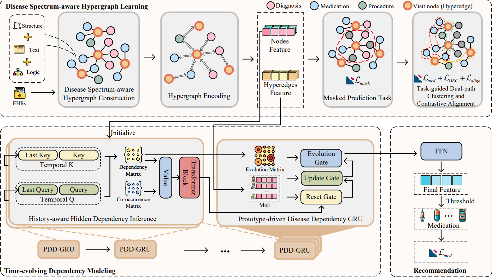

# SpecTD-MR
Disease Spectrum-aware and Time-evolving Dependency Learning for Medication Recommendation

## 📝 Overview

This repository contains the official PyTorch implementation of the paper: Disease Spectrum-aware and Time-evolving Dependency Learning for Medication Recommendation.

In this work, we propose SpecTD-MR, a novel framework designed to address the limitations of disease spectrum fragmentation and implicit dependency modeling in medication recommendation systems. By synergizing a Disease Spectrum-aware Hypergraph Learning module with a Time-evolving Dependency Modeling module, our approach unifies pathologically related diagnoses into cohesive representations and explicitly quantifies the fine-grained, causal evolution of patient health states.

## 🚀 Quick Start

1. Prepare the environment and preprocess both MIMIC datasets (see ⚙️ Setup).
2. Run Stage-I pretraining to learn spectrum-aware concept representations (Stage-I Pretraining).
3. Launch Stage-II medication recommendation to fine-tune SpecTD-MR with downstream supervision (Stage-II Recommendation).
4. Inspect logs under `pretrain_logs/` and `downstream_logs/`, then evaluate the generated medication predictions.

## 🌟 Key Contributions

- We propose a Disease Spectrum-aware Hypergraph Learning module to overcome the fragmentation of disease spectra. This module unifies pathologically related diseases into cohesive, spectrum-aware representations.

- We introduce a Time-evolving Dependency Modeling module to explicitly quantify dependency strength and accurately model the process of disease evolution. This module synergizes disease spectrum with time-evolving dependency to adaptively regulate the transition of patient health states.

- We propose SpecTD-MR, a unified framework that synergistically addresses the limitations of fragmented disease spectra and coarse-grained implicit disease evolution, and clearly outperforms state-of-the-art baselines on real-world datasets while providing interpretable insights into dynamic disease evolution.

## 🏗️ Model Architecture


## ⚙️ Setup
### Environment

```shell
python==3.9.18
torch==2.1.0
tqdm==4.67.1
dgl==1.1.2.cu118
scikit-learn==1.6.1
```

You can build the conda environment for our experiment using the following command:

```shell
conda env create -f environment.yml
```

### 📊 Datasets
We used two datasets, MIMIC-III v1.4 and MIMIC-IV v1.0, for our experiments.

### Data Processing

```bash
# Preprocess MIMIC-III
python preprocess_mimic-iii.py

# Preprocess MIMIC-IV
python preprocess_mimic-iv.py
```

These scripts extract longitudinal visit sequences, build the diagnosis/procedure/medication vocabularies, and generate the intermediate files required for Stage-I pretraining and downstream experiments.

### Multi-source Concept Features

To enhance the semantic capacity of the model, each medical concept node is endowed with three raw feature sources:

1. **Structural features** : DeepWalk-based embeddings learned on the concept co-occurrence graph.
2. **Textual features** : SapBERT encodings derived from the textual descriptions of the concepts.
3. **Logical hierarchy features** : Poincaré embeddings that capture the ICD/ATC hierarchical structure.

For diagnoses, procedures, and medications, we compute SapBERT text embeddings, Poincaré hyperbolic hierarchy embeddings, and co-occurrence structural embeddings separately.


## 🧪 Training Pipeline

The following MIMIC-III example uses the fixed parameters from
`run_mimic3.sh`. A single Stage-I command runs Warmup1, Warmup2, and the full
objective in sequence, then loads the best Warmup2 state before full training.

### Stage-I Pretraining

```bash
python -m pretrain.train_pretrain \
  --struct-emb-path data/MIMIC-III/emb/struct_deepwalk.pt \
  --text-emb-path data/MIMIC-III/emb/text_embeddings.pt \
  --logic-emb-path data/MIMIC-III/emb/logic_embeddings.pt \
  --records-path data/MIMIC-III/records_final.pkl \
  --voc-path data/MIMIC-III/voc_final.pkl \
  --ddi-path data/MIMIC-III/ddi_A_final.pkl \
  --batch-size 64 \
  --lr 0.001 \
  --feature-dim 64 \
  --hidden-dim 128 \
  --mask-mode bert \
  --mask-token-prob 0.8 \
  --mask-random-prob 0.1 \
  --dropout 0.1 \
  --weight-decay 0.0001 \
  --num-layers 2 \
  --mlp-layers 2 \
  --heads 4 \
  --num-clusters 5 \
  --cluster-weight 0.75 \
  --alignment-weight 0.05 \
  --warmup1-epochs 50 \
  --warmup2-epochs 80 \
  --warmup2-patience 10 \
  --warmup2-best-path pretrain_logs/mimic3-two-stage/mimic3-run-01/warmup2_best.pt \
  --epochs 120 \
  --full-patience 15 \
  --full-best-path pretrain_logs/mimic3-two-stage/mimic3-run-01/stage1_full_best.pt \
  --log-dir pretrain_logs/mimic3-two-stage/mimic3-run-01/stage1 \
  --save-checkpoint \
  --device cuda:0 \
  --python-seed 1203 \
  --numpy-seed 2048 \
  --torch-seed 1203
```

### Stage-II Medication Recommendation

```bash
python -m recommender.train_downstream \
  --records-path data/MIMIC-III/records_final.pkl \
  --voc-path data/MIMIC-III/voc_final.pkl \
  --struct-emb-path data/MIMIC-III/emb/struct_deepwalk.pt \
  --text-emb-path data/MIMIC-III/emb/text_embeddings.pt \
  --logic-emb-path data/MIMIC-III/emb/logic_embeddings.pt \
  --ddi-path data/MIMIC-III/ddi_A_final.pkl \
  --concept-cooccurrence-path data/MIMIC-III/concept_cooccurrence.pkl \
  --pretrain-checkpoint pretrain_logs/mimic3-two-stage/mimic3-run-01/stage1/nc5_h4_fd64_clw0.75_alw0.05/stage1_final.pt \
  --sequence-encoder tgct \
  --seq-hidden-dim 128 \
  --epochs 80 \
  --batch-size 16 \
  --lr 0.0005 \
  --lr-stage1 0.00002 \
  --weight-decay 0.0001 \
  --seq-dropout 0.1 \
  --early-stopping-patience 20 \
  --lr-scheduler-patience 4 \
  --lr-scheduler-factor 0.5 \
  --bootstrap-rounds 10 \
  --log-dir downstream_logs/mimic3-two-stage/mimic3-run-01 \
  --device cuda:0 \
  --python-seed 1203 \
  --numpy-seed 2048 \
  --torch-seed 1203
```

Activate the environment and run either executable script:

```bash
conda activate tsp
./run_mimic3.sh
./run_mimic4.sh
./run_mimic4_hosp.sh
```

Logs, validation metrics, and checkpoints are stored under `pretrain_logs/`
and `downstream_logs/`.
